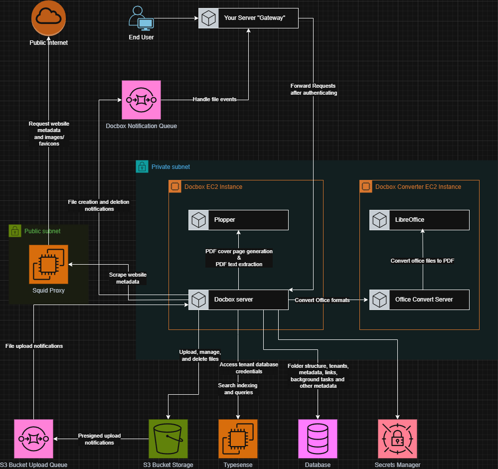

<h1> 

Docbox 
</h1>

[**Website →**](https://docbox-nz.pages.dev/)

**Docbox** is a modern, multi-tenant file management, processing, and search platform designed to seamlessly integrate into your application. It provides powerful capabilities for securely storing, processing, and retrieving documents.

**Docbox** is designed to run **behind your main service**, where your application acts as a **proxy**, forwarding requests to Docbox **after performing authentication and access control**. This keeps the core service secure and private.

Files, folders, and links are organized into logical groups called **Document Boxes**. Each Document Box is uniquely identified by a **scope string** (e.g. `user:xxxxxxxx-xxxx-xxxx-xxxx-xxxxxxxxxxxx:files`). The scope is embedded directly in the URL (e.g. `/box/user:xxxxxxxx-xxxx-xxxx-xxxx-xxxxxxxxxxxx:files/file/xxxxxxxx-xxxx-xxxx-xxxx-xxxxxxxxxxxx`), enabling efficient and reliable access control without requiring inspecting requests beyond the request path.

## 🚀 Features

- 📂 File Management
  - Uploading and renaming files
  - Folders 
  - "Link" files
- 🔍 Full-Text Search
  - Powerful Typesense based queries
  - Full text down to page-by-page level results
- ⚙️ Document Processing
  - Generate PDF files for viewing office files in browsers
    - Powered by LibreOffice generates PDF files from common office formats
  - Extract text from documents
    - Full text searchable extracted text, on a page-by-page basis
  - Generate thumbnails for PDF files (and office files)
    - Multiple sized thumbnails for browser based viewing performance
  - Email (.eml message/rfc822) file processing
    - Inlining images 
    - Extracting and processing attachments
    - Text and HTML extraction
    - Full text searchable email contents
- 🌐 Web-scraping 
  - Built in support for scraping OGP metadata, favicons, and other details from links stored within 
- 🏢 Multi-Tenancy 
  - Fully isolated per-tenant database design for secure data separation

## 📦 Use Cases

- Secure, structured document storage
- Browser-based previews and thumbnails for office documents
- Email ingestion and indexing for discovery or archiving

## 🛠️ Technology Stack

- **Backend**: Rust
- **Database**: PostgreSQL
- **Search Engine**: Typesense or Opensearch
- **Storage**: S3-compatible object storage (e.g. AWS S3, MinIO)

